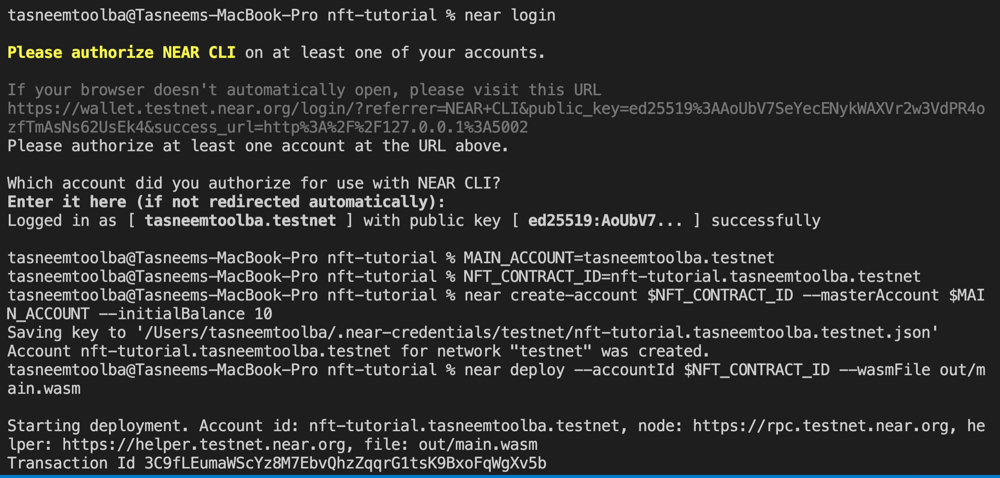
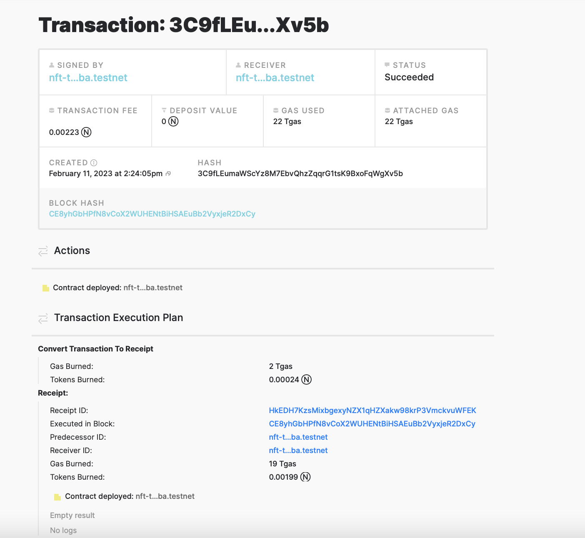
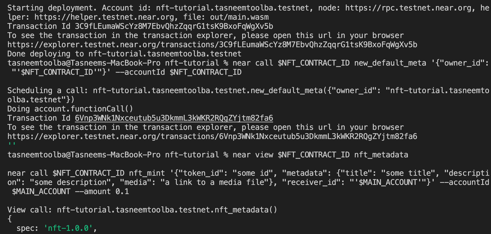
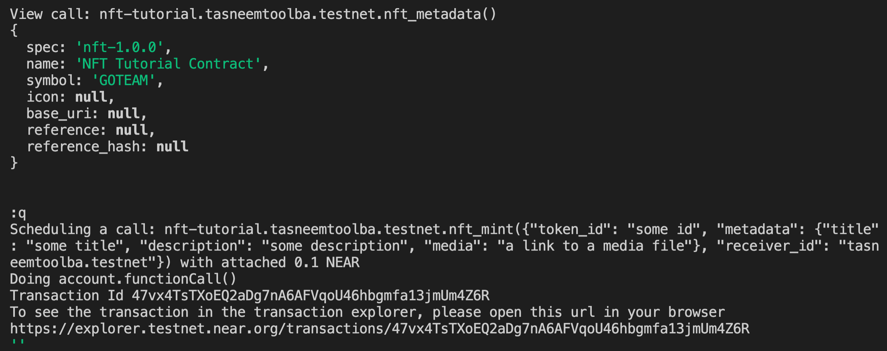
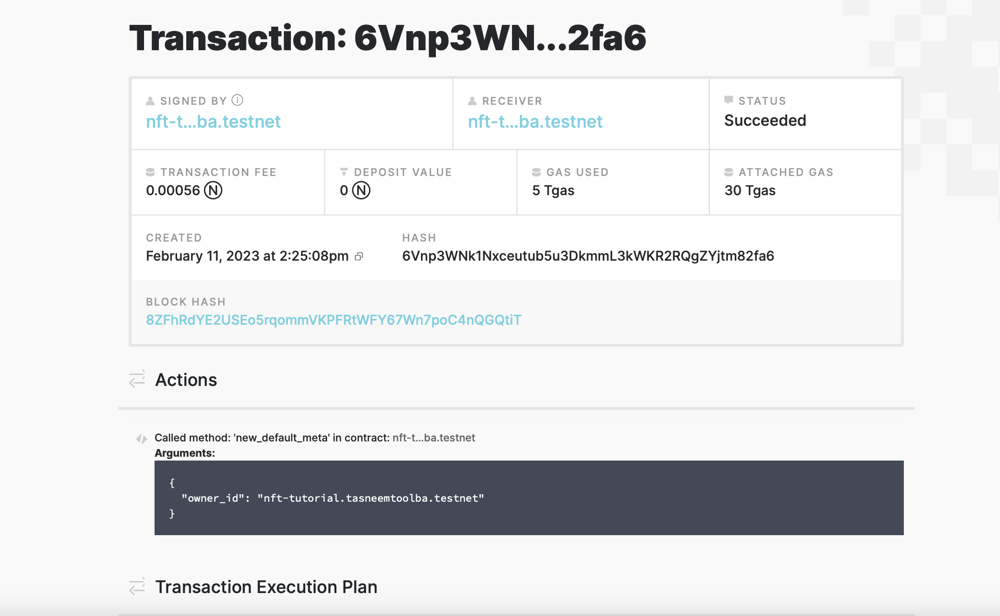
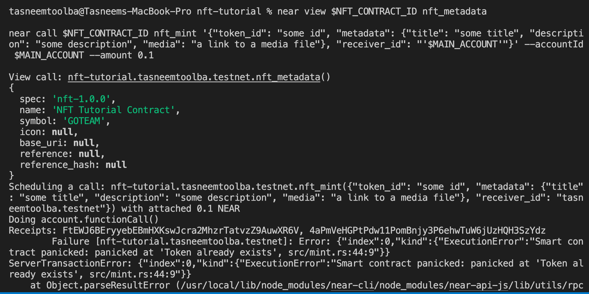
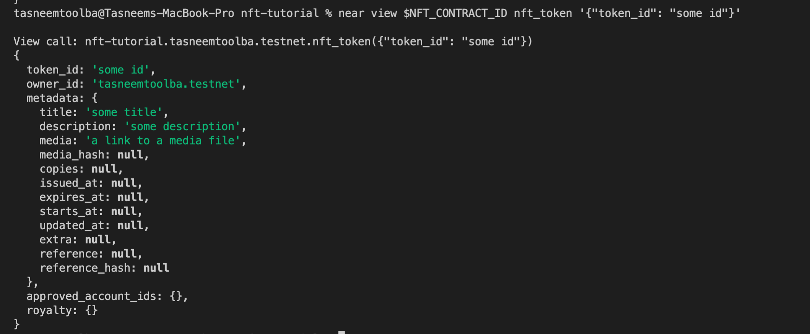
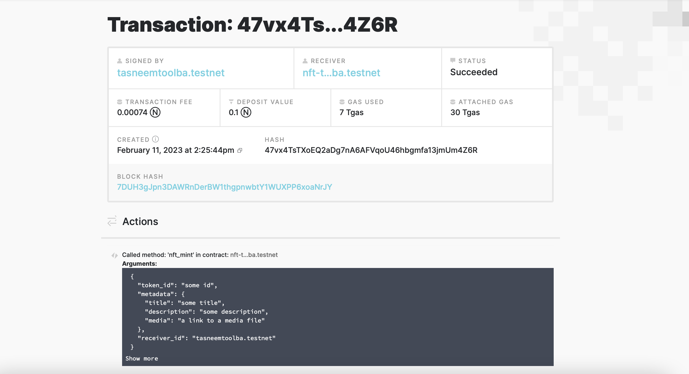

# Lab8 - report

Please, note. I created account with the following login **tasneemtoolba.testnet**, and ID of my contract is **nft-tutorial.tasneemtoolba.testnet**.

### Results of commands
`near login`

`near create-account $NFT_CONTRACT_ID --masterAccount $MAIN_ACCOUNT --initialBalance 10`

`near deploy --accountId $NFT_CONTRACT_ID --wasmFile out/main.wasm`

### Screenshot of the first transaction

### Result of the command 
`near call $NFT_CONTRACT_ID new_default_meta '{"owner_id": "'$NFT_CONTRACT_ID'"}' --accountId $NFT_CONTRACT_ID`

`near view $NFT_CONTRACT_ID nft_metadata`

`near call $NFT_CONTRACT_ID nft_mint '{"token_id": "some id", "metadata": {"title": "some title", "description": "some description", "media": "a link to a media file"}, "receiver_id": "'$MAIN_ACCOUNT'"}' --accountId $MAIN_ACCOUNT --amount 0.1`

### Screenshot of the second transaction

### Result of the rest of commands 

### Screenshot of the last transactions

